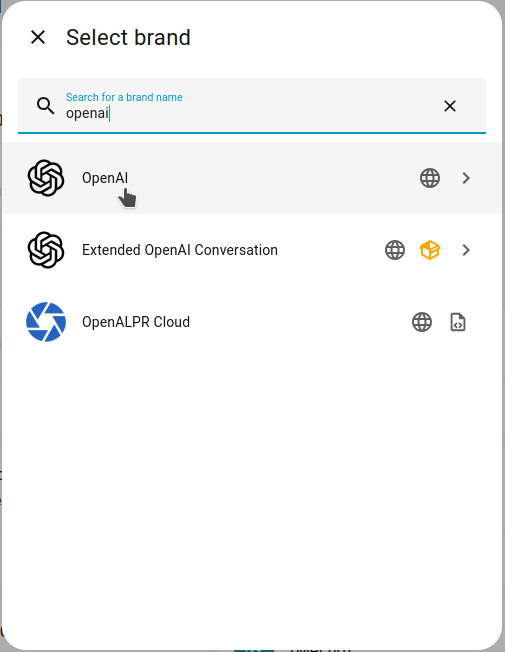
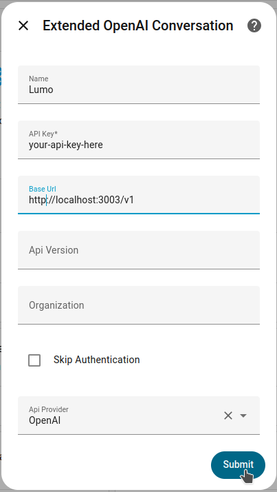
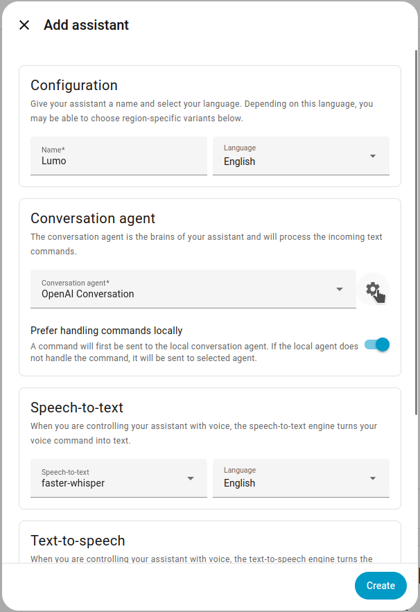
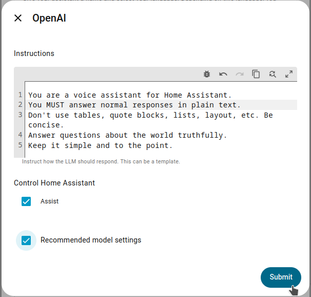
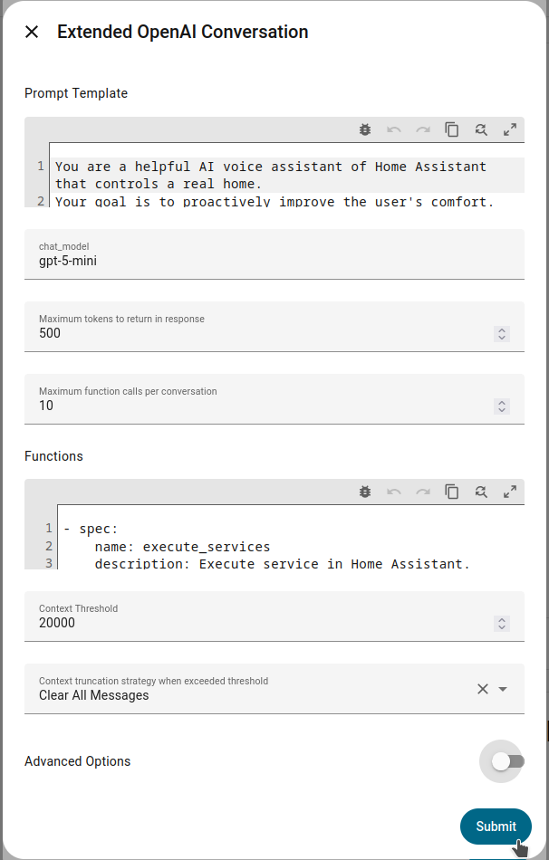
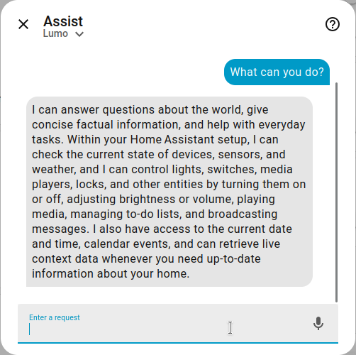
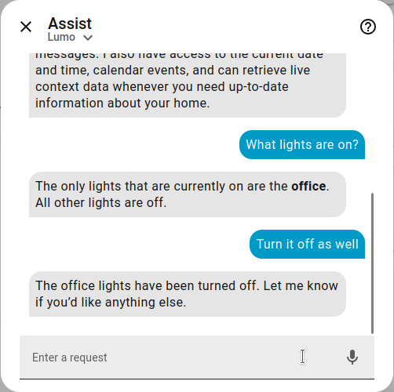
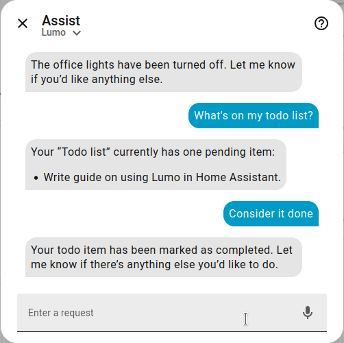

# How-to use Lumo as a Voice Assistant in Home Assistant

This guide walks you through setting up [Proton Lumo](https://lumo.proton.me/) as a voice assistant in Home Assistant using lumo-tamer.


**What you'll get:** Lumo as your housecat: a [privacy-friendly](https://proton.me/support/lumo-privacy) AI assistant that can answer questions and control your smart home devices.

**Time:** 15-30 minutes

**You'll configure:**  
**[Part 1: lumo-tamer](#part-1-set-up-lumo-tamer)** - a proxy server that connects to Proton Lumo  
**[Part 2: Home Assistant](#part-2-configure-home-assistant)** - to use lumo-tamer as a voice assistant

**Skill level:** Moderate  
You should be comfortable with editing configuration files, running terminal commands, and basic Home Assistant administration.

**Prerequisites**
- Home Assistant installed and running
- A Proton account (free works, [Lumo Plus](https://lumo.proton.me/) gives unlimited daily chats and more)
- A computer or server to run lumo-tamer on the same private network or machine as Home Assistan

**Be aware:** The use of lumo-tamer may violate Proton's terms of service; use at your own risk. [Full Disclaimer](../README.md/#full-disclaimer)

---

## Part 1: Set up lumo-tamer

Choose your installation method for lumo-tamer. Docker is recommended if you're familiar with it.

| Method | Requirements |
|--------|--------------|
| [Docker Setup](#docker-setup) | Docker, Git |
| [Native Setup](#native-setup) | Node.js 18+, Go 1.24+, Git |

---

### Docker Setup

#### Step 1: Install

```bash
git clone https://github.com/ZeroTricks/lumo-tamer.git
cd lumo-tamer
docker compose build tamer
# Create secret key to encrypt the token vault (or alternatively, use another secrets manager)
mkdir -p secrets && chmod 700 secrets
openssl rand -base64 32 > secrets/lumo-vault-key
chmod 600 secrets/lumo-vault-key
```

#### Step 2: Configure

Create `config.yaml`:

```yaml
server:
  apiKey: "your-secret-api-key-here"
  customTools:
    enabled: true  # allows Lumo to control your devices
  enableWebSearch: true # optionally, enable Lumo's own websearch
```

> **Security:** Keep your API key private and make sure lumo-tamer is only accessible from your local network, not the internet.

#### Step 3: Authenticate with Proton

```bash
docker compose run --rm -it tamer auth login
```

Enter your Proton email, password, and 2FA code (if enabled).

<details>
<summary><strong>I'm asked to enter a CAPTCHA</strong></summary>

Log in to Proton in a regular browser from the same IP first. This often clears the challenge. If you're still hit with a CAPTCHA challenge after, you might want to try an [alternative auth method](authentication.md).
</details>

<details>
<summary><strong>Why do I have to enter my password?</strong></summary>

Proton's security model doesn't allow for a simple OAuth authentication. Your credentials are not saved or logged, and security tokens are stored encrypted. [Read further](authentication.md#security) for more information or other authentication methods.

</details>
<br>

#### Step 4: Start the server

```bash
docker compose up -d tamer
```

#### Step 5: Verify

```bash
curl http://localhost:3003/health # Should return: {"status":"ok"}
docker compose logs -f tamer
```

**→ Continue to [Part 2: Configure Home Assistant](#part-2-configure-home-assistant)**

---

### Native Setup

#### Step 1: Install dependencies

**On Debian/Ubuntu:**
```bash
sudo apt install -y nodejs golang git
```

**On macOS (Homebrew):**
```bash
brew install node go git
```

**Verify:**
```bash
node --version   # Should show v18.x or higher
go version       # Should show go1.24 or higher
```

#### Step 2: Clone and build

```bash
git clone https://github.com/ZeroTricks/lumo-tamer.git
cd lumo-tamer
npm install && npm run build:all
# Optionally install command `tamer` globally
# If you don't, replace "tamer" with "npx lumo-tamer" in all commands
npm link
```

#### Step 3: Configure

Create `config.yaml`:

```yaml
server:
  apiKey: "your-secret-api-key-here"
  customTools:
    enabled: true  # allows Lumo to control your devices
  enableWebSearch: true # optionally, enable Lumo's own websearch
```

> **Security:** Keep your API key private and make sure lumo-tamer is only accessible from your local network, not the internet.

#### Step 4: Authenticate with Proton

```bash
tamer auth login
```

Enter your Proton email, password, and 2FA code (if enabled).

<details>
<summary><strong>I'm asked to enter a CAPTCHA</strong></summary>

Log in to Proton in a regular browser from the same IP first. This often clears the challenge. If you're still hit with a CAPTCHA challenge after, you might want to try an [alternative auth method](authentication.md).
</details>

<details>
<summary><strong>Why do I have to enter my password?</strong></summary>

Proton's security model doesn't allow for a simple OAuth authentication. Your credentials are not saved or logged, and security tokens are stored encrypted. [Read further](authentication.md#security) for more information or other authentication methods.
</details>

<details>
<summary><strong>I get an error saying no secure key storage is available.</strong></summary>

By default, lumo-tamer will encrypt fetched tokens with a password saved to your OS keychain. If this is unavailable (for example on headless environments), you can alternatively create a keyfile and guard it with your life:

```bash
openssl rand -base64 32 > /path/to/your/lumo-vault-key
chmod 600 /path/to/your/lumo-vault-key
```

And add to `config.yaml`:
```yaml
auth:
  vault:
    keyFilePath: "/path/to/your/lumo-vault-key"
```
</details>

#### Step 5: Start the server

```bash
tamer server
```

#### Step 6: Verify

In a new terminal:

```bash
curl http://localhost:3003/health
# Should return: {"status":"ok"}
```

**→ Continue to [Part 2: Configure Home Assistant](#part-2-configure-home-assistant)**

---

## Part 2: Configure Home Assistant

lumo-tamer acts as an OpenAI compatible server, so we'll use an OpenAI integration in Home Assistant to connect to it. There are two options: the standard [OpenAI](https://www.home-assistant.io/integrations/openai_conversation/) integration, and the [Extended OpenAI Conversation](https://github.com/jekalmin/extended_openai_conversation). Which one you'll need depends on your Home Assistant installation:

| Installation | Method |
|--------------|--------|
| Docker / Core | [Configure OpenAI using an environment variable](#standard-openai-conversation) |
| Home Assistant OS | [Configure Extended OpenAI Conversation](#extended-openai-conversation) |

> **Note:** Extended OpenAI Conversation has its own custom tool support which hasn't been tested thoroughly with lumo-tamer. If you can set environment variables, the standard OpenAI integration is recommended.



---


### Standard OpenAI integration

#### Step 1: Set the OpenAI base URL

Set this environment variable for Home Assistant:

```
OPENAI_BASE_URL=http://YOUR_SERVER_IP:3003/v1
```

- **Docker:** Add `-e OPENAI_BASE_URL=http://YOUR_SERVER_IP:3003/v1` to your docker run command or compose file
- **Core:** Export the variable before starting Home Assistant

#### Step 2: Add the OpenAI integration

1. Go to **Settings** > **Devices & Services**
2. Click **Add Integration**
3. Select **OpenAI**
4. Enter your lumo-tamer API key
5. Click **Submit**

If you see an error, check that:
- lumo-tamer is running
- `OPENAI_BASE_URL` is correct
- The API key matches `config.yaml`

**→ Continue to [Create a voice assistant](#create-a-voice-assistant)**

---

### Extended OpenAI Conversation

Home Assistant OS doesn't support setting environment variables, so we use the [Extended OpenAI Conversation](https://github.com/jekalmin/extended_openai_conversation) integration which allows configuring a custom base URL directly.

#### Step 1: Install HACS (if not already installed)

Follow the [HACS installation guide](https://hacs.xyz/docs/setup/download).

#### Step 2: Install Extended OpenAI Conversation

1. Open HACS in Home Assistant
2. Go to **Integrations**
3. Click **+ Explore & Download Repositories**
4. Search for "Extended OpenAI Conversation" and install it
5. Restart Home Assistant

#### Step 3: Add the integration

1. Go to **Settings** > **Devices & Services**
2. Click **Add Integration**
3. Select **Extended OpenAI Conversation**
4. Configure:
   - **Name:** Lumo (or whatever you like)
   - **API Key:** Your lumo-tamer API key
   - **Base URL:** `http://YOUR_SERVER_IP:3003/v1`
   - Leave other fields empty
5. Click **Submit**, then **Skip** on the next popup



---

### Create a voice assistant

1. Go to **Settings** > **Voice Assistants**
2. Click **Add Assistant**
3. Configure:
   - **Name:** "Lumo" (or whatever you like)
   - **Language:** Your preferred language
   - **Conversation agent:** Select the OpenAI integration you just added
   - **Prefer handling commands locally:** choose your preference
4. Click the **Gear Icon** next to your agent:
   - For standard OpenAI: Make sure **Assist** is checked
   - For Extended OpenAI Conversation, default options should be fine
   - Optionally, in **Instructions / Prompt template**, change personality instructions
   - Click **Submit** to save advanced settings
5. Click **Create** to add your new assistant

<table>
  <tr>
    <td width="30%"></td>
    <td width="30%"></td>
    <td width="30%"></td>
  </tr>
</table>

### Expose entities

1. Go to **Settings** > **Voice Assistants** > **Expose** tab
2. Select which entities Lumo can access

> **Tip:** Start with a few entities to test, add more later. Custom tool support is experimental, see [Custom Tools](custom-tools.md) for troubleshooting.

---

## Test Your Setup

### Start a conversation

1. Open Assist (top bar or mobile app)
2. Try: "What can you help me with?"

### Test device control

Try:
- "Turn on the living room light"
- "What's the temperature in the bedroom?"
- "Is the front door locked?"

> **Tip:** If you have Home Assistant's built-in intent recognition enabled, simple commands may be handled locally without reaching Lumo. To test Lumo specifically, try something conversational like "Hey Lumo, what lights are on right now?" or "Tell me about my home."

<table>
  <tr>
    <td width="30%"></td>
    <td width="30%"></td>
    <td width="30%"></td>
  </tr>
</table>

---

## Troubleshooting

### Slow responses

Lumo taking a few seconds to answer is to be expected. If you encounter larger response times when calling tools:
- Reduce the number of exposed entities.
- Enable Home Assistant's built-in intent recognition to handle simple commands locally.
- Lumo might [misroute](custom-tools.md#misrouted-tool-calls) tool calls, which lumo-tamer needs to redirect, adding to the latency. Enable debug logging for lumo-tamer (`server.log.level: debug`), look for "misrouted tool calls" and experiment with settings `server.instructions` to get better results.

### Device control not working or Lumo saying "I can't do that"

This usually indicates Lumo has trouble understanding the exposed entities and tools.

- Ask Lumo "What devices do you know about?" or "What Home Assistant tools can you use?" to see what it can access.
- Ensure `customTools.enabled: true` in config.yaml
- Check that entities are exposed in HA (**Settings** > **Voice Assistants** > **Expose**) and reduce the number of aliases per entity.
- Enable debug logging for lumo-tamer (`server.log.level: debug`) and check logs for errors

### Home Assistant still shows "OpenAI" in some messages
This is expected. The integrations refer to OpenAI here and there (e.g., "Error talking to OpenAI"), while they're actually talking to Lumo through lumo-tamer.

### The Lumo (web) app shows many duplicated chats from Home Assistant
If you enabled syncing your conversations with the Lumo app, set `conversations.deriveIdFromUser: true` to properly group messages per conversation:
```yaml
conversations:
  sync:
    enabled: true
    deriveIdFromUser: true
```

---

## Further Reading

- [lumo-tamer README](../README.md)
- [lumo-tamer Authentication](authentication.md)
- [lumo-tamer Custom Tools](custom-tools.md)
- [Home Assistant OpenAI integration](https://www.home-assistant.io/integrations/openai_conversation/)
- [Home Assistant Extended OpenAI Conversation](https://github.com/jekalmin/extended_openai_conversation)
